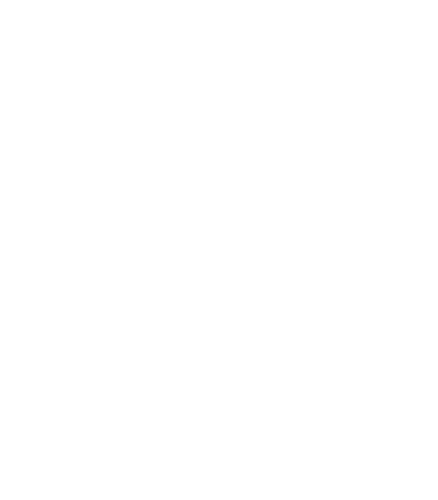
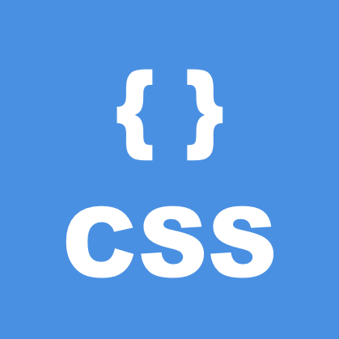
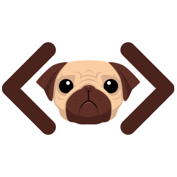
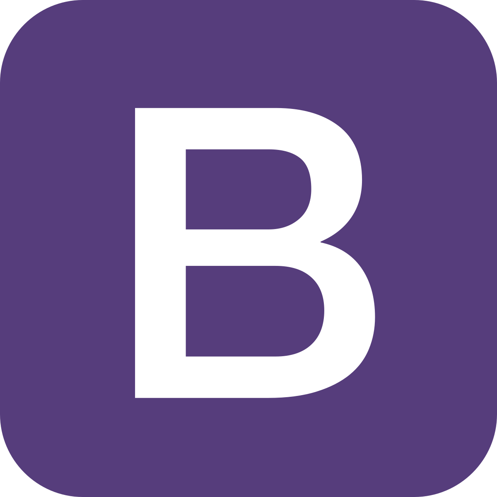
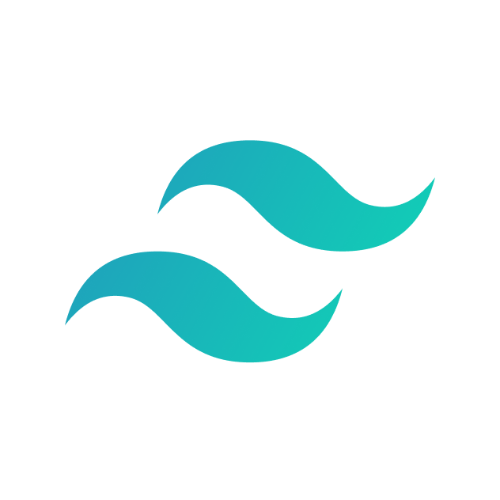
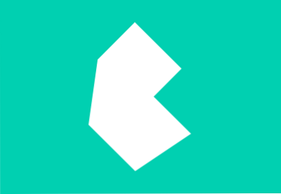
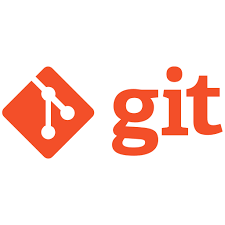
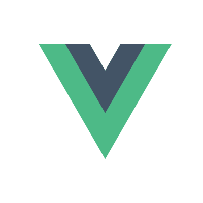
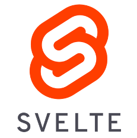

<h1 align="center">@bkfan1</h1>
<h2 align="center">🌐 Web developer</h2>

    
<h3>I know 🧠:</h3>

    <h3>Programming languages:</h3>
    
    
    
     
    <h3>Runtimes:</h3>
    
     
    <h3>Language Frameworks:</h3>
    
     
    <h3>Markup and Style languages:</h3>
    
    
    
     
     
    <h3>Preprocessors & Template Engines:</h3>
    
    
     
     
    <h3>Query languages:</h3>
    
     
     
    <h3>CSS Frameworks:</h3>
    
    
    
     
     
    <h3>Dev Ops</h3>
    
    
     
     
    <h3>Systems:</h3>
    
    <h4>(Arch & Ubuntu)</h4>

 
 

    
<h3>I want to learn / I'm currently learning 📖💡:</h3>

    <h3>Programming languages:</h3>
    
    
    
    
     
     
     
     
    <h3>Language Frameworks:</h3>
    
    
    

 
 

    
<h3>About me 👨🏻‍💻</h3>

    <h3> · Personal:</h3>
    <ul>
        <li><h4>From: 🇻🇪</h4></li>
        <li><h4>19 years old</h4></li>
    </ul>
     
    <h3> · Hobbies ⏲️:</h3>
    <ul>
        <li><h4>Skateboarding 🛹,Writing & reading 📚📓, Drawing & painting ✏️🖌️, Playing Bass 🎸</h4></li>

    </ul>

